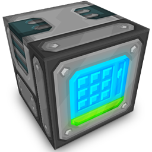

## A [PureBDCraft](http://bdcraft.net/) patch for the [RefinedStorage](https://minecraft.curseforge.com/projects/refined-storage) Minecraft mod

## Uses [Sphaxify](https://github.com/GrumpyPirate/Sphaxify) to build and optimise packs
### To install locally:
- Install [Node.js](https://nodejs.org/en/)
- Install [ImageMagick](http://www.imagemagick.org/script/binary-releases.php)
- Install [GraphicsMagick](http://www.graphicsmagick.org/download.html)
- Open a terminal within the cloned project directory (e.g. `cd /path/to/sphax-patch-refinedstorage/`)
  - `npm install`
- Once complete, use `npm run optimise` to build every 512x/256x/128x/64x/32x size pack from the source files.
