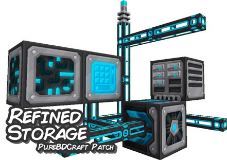

## A [PureBDCraft](http://bdcraft.net/) patch for the [RefinedStorage](https://minecraft.curseforge.com/projects/refined-storage) Minecraft mod
- Source designs are found under [`/source-designs`](./source-designs)
- Generated texture packs (including zips) are found under [`/size-packs`](./size-packs)

## To install
Simply download the latest release, or grab one of the zips directly from [the size packs directory](./size-packs/).

## Uses [Sphaxify](https://github.com/GrumpyPirate/Sphaxify) to build and optimise packs
### To build locally:
- Install [Node.js](https://nodejs.org/en/)
- Install [ImageMagick](http://www.imagemagick.org/script/binary-releases.php)
- Install [GraphicsMagick](http://www.graphicsmagick.org/download.html)
- Open a terminal within the cloned project directory (e.g. `cd /path/to/sphax-patch-refinedstorage/`)
  - `npm install`
- Once complete, use the following commands:
 - `npm run build` - build every 512x/256x/128x/64x/32x size pack from the source files
 - `npm run zip` - build *and* generate zip files for the pack

## Notes
- Storage parts should be redone at some point in the future, they're not quite as good as they could be.
